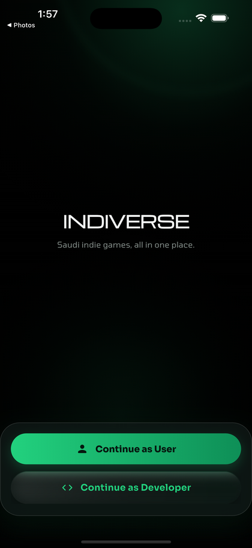
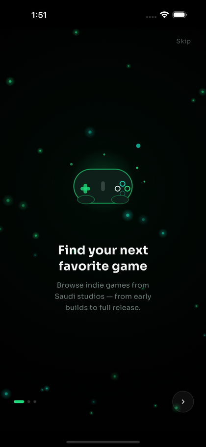
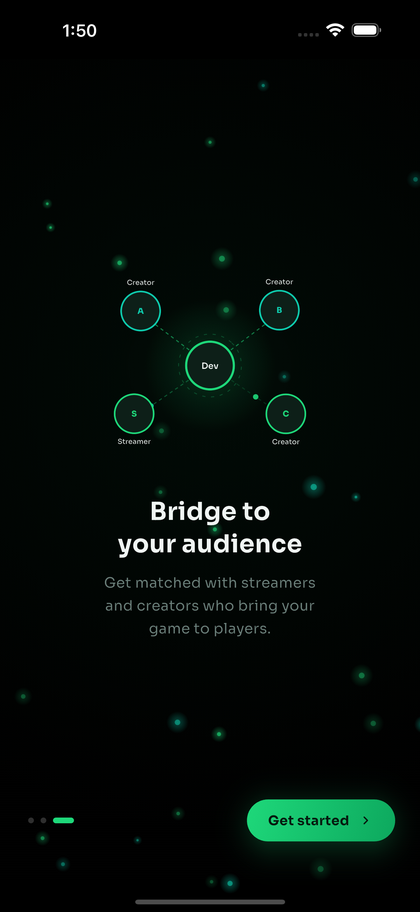
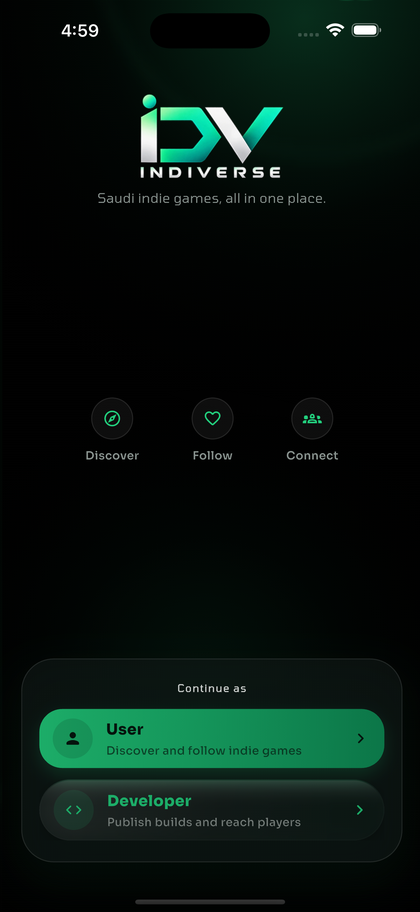

# 🎮 INDIVERSE — Where Saudi Indie Games Find Their Audience

> Discover Saudi-made indie games as a player, or publish your own and reach
> players, streamers, and content creators as a developer — all in one app.

<p align="center">
  
  
  
  
</p>

---

## 📖 About INDIVERSE

**INDIVERSE** is a two-sided platform for the Saudi indie game scene. On one
side, **players** discover games from local studios, follow their progress
from early builds to launch, wishlist what they're excited about, and opt in
to playtest. On the other side, **developers** publish their game, schedule
milestones and events, run creator campaigns to get their game in front of
streamers, and manage the playtesters who signed up.

Everything is backed by [Supabase](https://supabase.com) — Postgres for data,
built-in Auth for accounts — with a single role flag on each account deciding
whether someone lands in the **Player** app or the **Developer** app.

### App journey

**Animated splash → Three-slide onboarding → Choose Player or Developer →
Sign in or create an account → Role-specific home**

## ✨ Features

### For players

- 🏠 Home feed with a featured game, an upcoming-events carousel, and
  genre-matched picks based on saved preferences
- 🧭 Explore tab to browse and filter the full catalogue
- ❤️ One-tap wishlist, synced per account
- 🙋 Register interest in playtesting a game directly from its detail page
- 🎛️ Editable preferences (genres, platforms, languages, game stage, play
  style) that quietly personalize the Home feed
- 👤 Profile with an iOS-style confirmation sheet before signing out

### For developers

- 📦 Publish and edit games — genres, pricing, release status, Arabic-language
  support, Steam link, awards, and cover art
- 🗓️ Schedule and edit game events (release days, streams, community
  meetups) shown on players' Home carousel
- 📣 Create creator-outreach campaigns per game (platform, content type, key
  count) and review incoming creator requests (accept / decline)
- 🧑‍🤝‍🧑 See who registered playtest interest for each game, with their name
  and email
- 📊 Developer dashboard stats and a dedicated profile tab

### Shared, cross-cutting

- 🔐 Email/password auth with a role stored on the account (`player` /
  `developer`) that the app reads once and routes on every launch
- 🌌 A fully custom, hand-tuned splash and onboarding sequence — no template:
  a `Ticker`-driven particle field that reacts to swipe velocity, `CustomPaint`
  illustrations, and per-character title reveals
- 🛡️ First-run onboarding is shown exactly once per install (not per
  sign-out), tracked locally and reset only on a genuine logout

## 📱 App Walkthrough

### 1. A living entrance

The splash screen fades in the wordmark over an ambient particle field, then
hands off to onboarding — three swipeable pages, each with its own
`CustomPainter` illustration, that introduce discovery, dev-log-style
progress sharing, and creator matching. The particle field reacts to swipe
velocity in real time: particles drift and glow brighter the faster you drag.

<p align="center">
  
  &nbsp;&nbsp;&nbsp;&nbsp;
  
  &nbsp;&nbsp;&nbsp;&nbsp;
  
</p>

<p align="center"><sub>Animated splash &nbsp;•&nbsp; Discover indie games &nbsp;•&nbsp; Bridge to your audience</sub></p>

### 2. One app, two roles

After onboarding, a single role-selection screen splits the experience:
**Continue as User** for players, **Continue as Developer** for studios.
Each leads to its own sign-in/sign-up flow and, from there, its own
four-tab shell.

<p align="center">
  
</p>

<p align="center"><sub>Choose Player or Developer</sub></p>

### 3. Player tabs — Home · Explore · Wishlist · Profile

Home surfaces a featured game, an upcoming-events carousel pulled from every
developer's scheduled events, and genre-matched picks. Explore is the full
catalogue with filtering. Wishlist tracks saved games per account. Profile
holds editable discovery preferences and sign-out.

### 4. Developer tabs — Home · Playtesters · Creator Outreach · Profile

Home lists the developer's own games with quick stats and an add/edit flow
that includes scheduling events. Playtesters shows everyone who registered
interest in any of the developer's games. Creator Outreach is where campaigns
are created and incoming creator requests are accepted or declined.

## 🎨 Design System

INDIVERSE uses a near-black, **Signal Green** palette — dark enough to let
game art and screenshots be the color, with a single saturated green reserved
for actions and state.

| Token | Hex | Purpose |
|---|---|---|
| Background | `#000000` | App background |
| Surface / Surface Raised | `#090F0D` / `#101917` | Cards, sheets, raised panels |
| Signal Green (primary) | `#22D17E` | Primary actions, active states |
| Primary Deep | `#0E8F57` | Gradient partner for primary |
| Text Primary / Secondary | `#F3F5F4` / `#8A9490` | Body copy hierarchy |
| Border | `#1E2A26` | Hairlines and dividers |
| Warning / Error | `#F1B85B` / `#FF6B6B` | Status colors |

The splash/onboarding flow uses its own closely-related accent pair
(`#1ED87A` green, `#0ECBAD` teal) to match the brand mark exactly, kept
separate from the app-wide theme on purpose — see
[`lib/painters/onboarding_palette.dart`](lib/painters/onboarding_palette.dart).

Three typefaces, one job each: **Michroma** for titles, **Tomorrow** for
supporting detail copy, **Sora** for buttons, inputs, and general UI —
see [`lib/core/constants/text_styles.dart`](lib/core/constants/text_styles.dart).

## 🗄️ Data & Backend

INDIVERSE talks to Supabase directly from the client (`supabase_flutter`),
using Postgres tables secured by Row Level Security instead of a bespoke
REST API. Each `lib/service/*.dart` file owns one table (or a small related
group) and returns typed models from `lib/models/`.

| Table | Owned by | Purpose |
|---|---|---|
| `games_made_in_ksa` | `Database` | The core game catalogue (both player-facing reads and developer writes) |
| `user_preferences` | `Database` | A player's genre/platform/language/play-style picks, used to personalize Home |
| `game_events` | `GameEventService` | Scheduled milestones/streams per game, shown on players' Home carousel |
| `creator_campaigns` | `CreatorCampaignService` | A developer's outreach campaigns (platform, content type, key count) |
| `creator_requests` | `CreatorRequestService` | Creator applications to a campaign, joined with `content_creators` |
| `content_creators` | (joined) | Streamer/creator directory referenced by requests |
| `playtest_interests` | `PlaytestInterestService` | Players who opted in to playtest a specific game, joined with `profiles` |

Auth (`AuthService`) wraps `supabase.auth` directly: sign up/in with
email+password, a `role` (`player`/`developer`) and optional
`developer_name`/`display_name` stored as user metadata at sign-up, and read
back on every launch to route between the Player and Developer shells.

## 🧱 Architecture

```text
lib/
├── main.dart                      # Supabase.initialize + MaterialApp
├── core/
│   ├── constants/                 # AppColors, AppTextStyles, AppTheme
│   └── widget/                    # Shared building blocks (confirm dialog, glass action, empty state)
├── models/                        # Typed JSON <-> Dart for every Supabase table
├── painters/                      # CustomPainter scenes for splash/onboarding
├── widgets/                       # particle_canvas.dart — the shared Ticker-driven particle field
├── service/                       # One service per Supabase table/concern
└── screens/
    ├── splash/                    # Splash + onboarding
    ├── authentication_screens/    # Role selection, player & developer sign in/up
    ├── player/                    # player_shell.dart — player tab shell
    ├── home/ explore/ wishlist/ profile/   # Player tabs
    └── Developer/                 # developer_shell.dart, dev tabs, add game/event/campaign flows
```

- **Models** own typed JSON conversion and any per-field formatting logic
  (e.g. `GameEvent.scheduleLabel`).
- **Services** own every Supabase query — screens never call `supabase.from(...)`
  directly.
- **Shells** (`PlayerShell`, `DeveloperShell`) own the bottom navigation,
  fetch the data every tab needs once, and hand it down — tabs stay dumb.
- **Painters** and **widgets/particle_canvas.dart** keep the hand-built
  splash/onboarding visuals out of the screen files that use them.

## 🧩 Flutter Concepts Used

`Ticker` / `SingleTickerProviderStateMixin`, `CustomPainter` + `Canvas`,
`AnimationController` (staggered, curved, repeating), `PageView` with live
scroll-position tracking, `ShaderMask` (splash shimmer), `IndexedStack`
(tab shells), `FutureBuilder`, `Navigator` + custom `PageRouteBuilder`
transitions, `showCupertinoDialog` (native-feeling confirmations),
`SharedPreferences` (local first-run state), and Supabase's Postgres client
+ Auth (no custom backend).

## 🚀 Getting Started

### Prerequisites

- Flutter SDK compatible with Dart `^3.12.2`
- Xcode + iOS Simulator (the project targets iOS; Android has not been
  configured/tested)
- A Supabase project with the tables above, or use the existing one
  configured in [`lib/main.dart`](lib/main.dart)

### Run INDIVERSE

```bash
flutter pub get
flutter run
```

### Verify the project

```bash
dart analyze lib
```

Expected result: **no analyzer issues** (a couple of `info`-level lint
suggestions in `auth_service.dart`/`game_event_service.dart` are the only
known exceptions).

## 🌟 Notable Engineering Details

- **Hand-built particle system** — a `Ticker`-driven field of 28 particles
  with per-particle depth, wrapping, and a glow halo, reused behind both the
  splash screen and the auth flow; `dragOffset` ties it directly to
  `PageView` swipe velocity for real-time parallax.
- **Onboarding shown exactly once** — the "seen onboarding" flag is written
  only when the user taps *Get started*, not the instant the splash screen
  loads, so force-quitting mid-onboarding correctly shows it again on the
  next launch. Signing out resets it (so the next cold start looks like a
  new install) without replaying onboarding while the app stays open —
  sign-out goes straight to role selection instead.
- **Fully custom `CustomPainter` illustrations** for all three onboarding
  scenes (a floating game controller, a milestone timeline, and a
  creator-network graph with animated signal dots along dashed connectors),
  matching an SVG reference design 1:1 via viewBox-style coordinate mapping.
- **Native-feeling confirmations** — sign-out uses `showCupertinoDialog`
  instead of a generic Material alert, matching iOS system dialog styling.

## 🧠 What We Practiced

- Designing a two-role app (Player / Developer) sharing one auth system and
  one design language, but almost entirely separate navigation and screens
- Modeling a real relational schema (games, events, campaigns, requests,
  creators, preferences) safely from Supabase's untyped JSON
- Driving custom, non-trivial animation (`Ticker`, `CustomPainter`,
  `AnimationController` staggering) without a canned animation package
- Getting first-run/local-state logic exactly right — persistence bugs here
  are easy to write and easy to miss without deliberately testing force-quit
  and cold-start paths
- Structuring a growing app around one service per backend table instead of
  a single God-object data layer

---

<p align="center">
  Made by <strong>Turki Mohammed</strong> and <strong>Faisal Alanazi</strong>
  for the Flutter Bootcamp Final Project.
</p>
